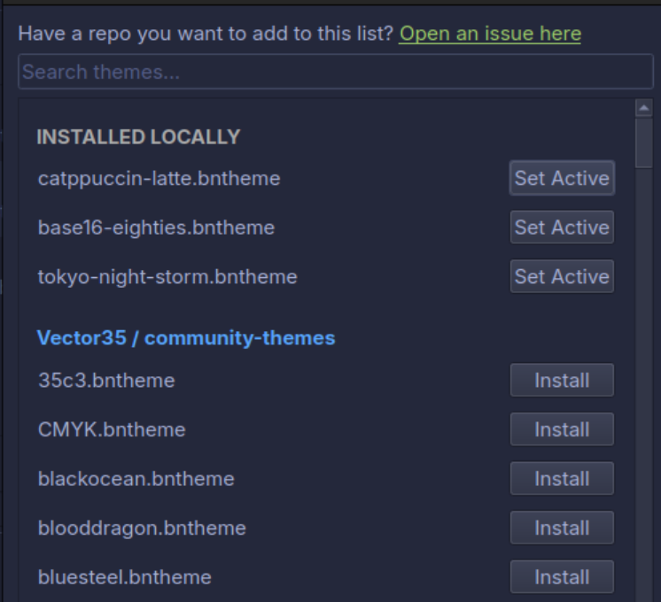

# A Theme Manager For Binary Ninja

> Developped for Binary Ninja 3.5

A simple plugin for browsing, installing, and applying community `.bntheme` themes inside Binary Ninja.

## Preview



## What it does

- Lists themes from configured GitHub repositories
- Shows installed themes locally
- Lets you apply a theme directly from the UI
- Basic search/filter for theme names

## Storage

Installed themes are saved to:

```
~/.binaryninja/community-themes/
```

## Usage

Open:

```
Plugins → Theme Manager
```

Then:
- Click **Install** to download a theme
- Click **Set** to apply it (may need restart)

## Supported repos

- Vector35 – community themes  
  https://github.com/Vector35/community-themes

- Catppuccin – Binary Ninja themes  
  https://github.com/catppuccin/binary-ninja/tree/main/themes

- Dracula – Binary Ninja theme  
  https://github.com/dracula/binary-ninja

- Evan Richter – Base16 Binary Ninja colors  
  https://github.com/evanrichter/base16-binary-ninja

- FuzzySecurity – Binary Ninja themes  
  https://github.com/FuzzySecurity/BinaryNinja-Themes

## Requirements

- Binary Ninja 3.5+
- Internet access for fetching themes

